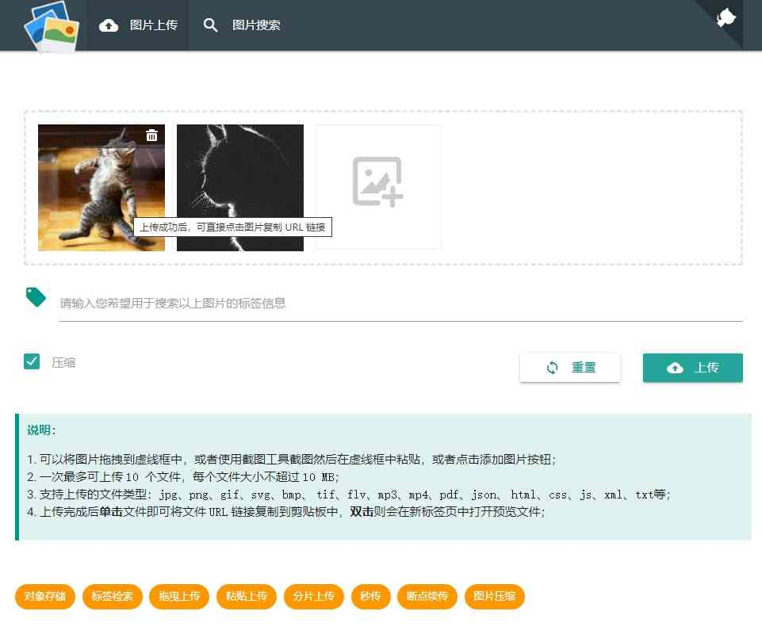

# 个人图床(持续开发中。。。)
使用springboot+minio+elasticsearch+webuploader实现图床，支持给图片打标签进行搜索，支持图片压缩，支持分片上传，秒传，断点续传。

## 功能

- [x] 对象存储
- [x] 标签高亮搜索
- [x] 图片压缩
- [x] 秒传
- [ ] 分片上传
- [ ] 断点续传
- [ ] docker化
- [ ] 移动端（微信小程序）

## 技术

### 前端

- 前端样式基于`materialize.css`框架实现
- 前端上传插件基于`webuploader`改造，改造参考我的另外一个仓库：[webuploader](https://github.com/tuituidan/webuploader)

### 后台

- 采用`minio`进行对象存储
- 使用`elasticsearch`对图片标签进行搜索
- `jpg`的压缩使用开源组件[thumbnailator](https://github.com/coobird/thumbnailator)，`png`压缩使用`OpenViewerFX`中的`PngCompressor`
- 上传接口除了`webuploader`使用的，还提供了一个`base64`图片上传接口

> elasticsearch需要安装ik中文分词插件

## 图片上传页

## 图片搜索页

